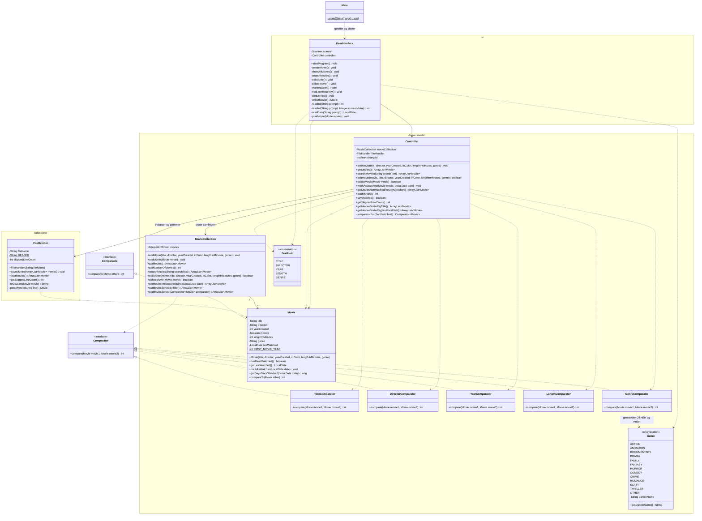

```mermaid
classDiagram
    direction TB

    class Main {
        ~main(String[] args) void$
    }

    class ComparableMovie["Comparable<Movie>"] {
        <<interface>>
        +compareTo(Movie other) int
    }

    class ComparatorMovie["Comparator<Movie>"] {
        <<interface>>
        +compare(Movie movie1, Movie movie2) int
    }

    namespace ui {
        class UserInterface {
            -Scanner scanner
            -Controller controller
            +startProgram() void
            -createMovie() void
            -showAllMovies() void
            -searchMovies() void
            -editMovie() void
            -deleteMovie() void
            -markAsSeen() void
            -notSeenRecently() void
            -sortMovies() void
            -selectMovie() Movie
            -readInt(String prompt) int
            -readInt(String prompt, Integer currentValue) int
            -readDate(String prompt) LocalDate
            -printMovie(Movie movie) void
        }
    }

    namespace domainmodel {
        class Controller {
            -MovieCollection movieCollection
            -FileHandler fileHandler
            -boolean changed
            +addMovie(title, director, yearCreated, inColor, lengthInMinutes, genre) void
            +getMovies() ArrayList~Movie~
            +searchMovies(String searchText) ArrayList~Movie~
            +editMovie(movie, title, director, yearCreated, inColor, lengthInMinutes, genre) boolean
            +deleteMovie(Movie movie) boolean
            +markAsWatched(Movie movie, LocalDate date) void
            +getMoviesNotWatchedForDays(int days) ArrayList~Movie~
            +loadMovies() int
            +saveMovies() boolean
            +getSkippedLineCount() int
            +getMoviesSortedByTitle() ArrayList~Movie~
            +getMoviesSortedBy(SortField field) ArrayList~Movie~
            -comparatorFor(SortField field) Comparator~Movie~
        }

        class MovieCollection {
            -ArrayList~Movie~ movies
            +addMovie(title, director, yearCreated, inColor, lengthInMinutes, genre) void
            +addMovie(Movie movie) void
            +getMovies() ArrayList~Movie~
            +getNumberOfMovies() int
            +searchMovies(String searchText) ArrayList~Movie~
            +editMovie(movie, title, director, yearCreated, inColor, lengthInMinutes, genre) boolean
            +deleteMovie(Movie movie) boolean
            +getMoviesNotWatchedSince(LocalDate date) ArrayList~Movie~
            +getMoviesSortedByTitle() ArrayList~Movie~
            +getMoviesSorted(Comparator~Movie~ comparator) ArrayList~Movie~
        }

        class Movie {
            -String title
            -String director
            -int yearCreated
            -boolean inColor
            -int lengthInMinutes
            -String genre
            -LocalDate lastWatched
            -int FIRST_MOVIE_YEAR$
            +Movie(title, director, yearCreated, inColor, lengthInMinutes, genre)
            +hasBeenWatched() boolean
            +getLastWatched() LocalDate
            +markAsWatched(LocalDate date) void
            +getDaysSinceWatched(LocalDate today) long
            +compareTo(Movie other) int
        }

        class Genre {
            <<enumeration>>
            ACTION
            ANIMATION
            DOCUMENTARY
            DRAMA
            FAMILY
            FANTASY
            HORROR
            COMEDY
            CRIME
            ROMANCE
            SCI_FI
            THRILLER
            OTHER
            -String danishName
            +getDanishName() String
        }

        class SortField {
            <<enumeration>>
            TITLE
            DIRECTOR
            YEAR
            LENGTH
            GENRE
        }

        class TitleComparator {
            +compare(Movie movie1, Movie movie2) int
        }

        class DirectorComparator {
            +compare(Movie movie1, Movie movie2) int
        }

        class YearComparator {
            +compare(Movie movie1, Movie movie2) int
        }

        class LengthComparator {
            +compare(Movie movie1, Movie movie2) int
        }

        class GenreComparator {
            +compare(Movie movie1, Movie movie2) int
        }
    }

    namespace datasource {
        class FileHandler {
            -String fileName
            -String HEADER$
            -int skippedLineCount
            +FileHandler(String fileName)
            +saveMovies(ArrayList~Movie~ movies) void
            +loadMovies() ArrayList~Movie~
            +getSkippedLineCount() int
            -toCsvLine(Movie movie) String
            -parseMovie(String line) Movie
        }
    }

    Main ..> UserInterface : opretter og starter
    UserInterface --> Controller
    UserInterface ..> Movie  
    UserInterface ..> Genre 
    UserInterface ..> SortField

    Controller --> MovieCollection : styrer samlingen
    Controller --> FileHandler : indlæser og gemmer
    Controller ..> Movie 
    Controller ..> SortField 
    Controller ..> TitleComparator 
    Controller ..> DirectorComparator 
    Controller ..> YearComparator 
    Controller ..> LengthComparator 
    Controller ..> GenreComparator

    MovieCollection "1" --> "0..*" Movie 
    MovieCollection ..> ComparatorMovie 
    FileHandler ..> Movie 
    GenreComparator ..> Genre : genkender OTHER og Andet

    ComparableMovie <|.. Movie
    ComparatorMovie <|.. TitleComparator
    ComparatorMovie <|.. DirectorComparator
    ComparatorMovie <|.. YearComparator
    ComparatorMovie <|.. LengthComparator
    ComparatorMovie <|.. GenreComparator
```